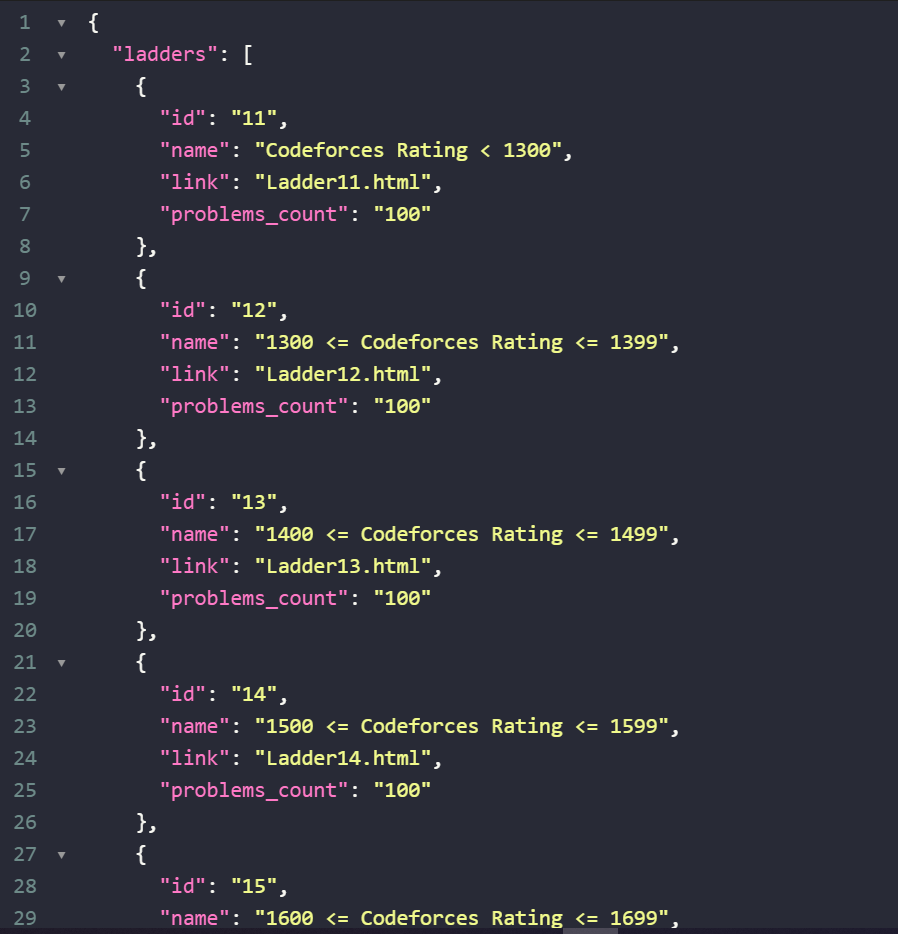

<h1 align="center">Dynamic A2OJ - Backend</h1>

<p align="center">
  
  <br>
  <i>Dynamic A2OJ is the dynamic version of Static A2OJ
    <br> It is made using ReactJS front-end and NodeJS and ExpressJS back-end</i>
  <br>
</p>

<p align="center">
  <a href="https://tungsten-ember-vacuum.glitch.me/" target="__blank"><strong>https://tungsten-ember-vacuum.glitch.me/</strong></a>
  <br>
</p>

## Screenshots

<p align="center">
  
</p>
<p align="center">
  
</p>

## Development Setup

### Prerequisites

- Install [Node.js] which includes [Node Package Manager][npm]

### Setting Up a Project

Create workspace:

```
mkdir [PROJECT NAME]
cd [PROJECT NAME]
```

Install [Nodemon] globally and install all packages:

```
npm i package.json
```

Run the application:

```
npm dev
```

**Love Dynamic A2OJ? Give our repo a star :star: :arrow_up:.**

[node.js]: https://nodejs.org/
[npm]: https://www.npmjs.com/get-npm
[nodemon]: https://www.npmjs.com/package/nodemon
